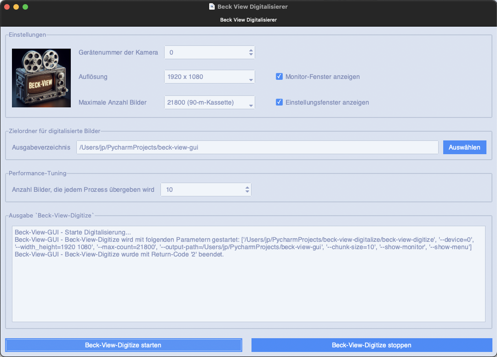

# Beck View GUI

**Beck View GUI** is a cross-platform graphical frontend for the
[`beck-view-digitize`](https://github.com/JuPfu/beck-view-digitize) application.

It provides a user-friendly interface to configure and control the digitisation
process of film material and launches the underlying backend as an external
process while displaying its live output inside the GUI.

The application is written in Python and uses **ttkbootstrap** to provide a
modern and consistent look and feel on Windows, macOS, and Linux.



*beck-view-gui during an active digitisation run.*

---

## 🚀 Features

* Graphical user interface for the `beck-view-digitize` backend
* GUI controls for all relevant digitisation parameters
* Configuration of:

  * Input / capture source settings
  * Output directory and base name
  * Image resolution
  * Exposure and capture-related parameters
  * **Exposure bracketing** ("Belichtungsreihe aktivieren")

    * passes `--bracketing` to the backend
    * captures three frames per analogue image with different exposure times
  * Optional image transformations
* Performance tuning by setting the chunk size of frames 
* Automatic construction of a valid backend command line
* Launches the backend as a **subprocess**
* Displays **real-time stdout / stderr output** in the GUI
* **Stop button** to terminate the running process cleanly

---

## 🧰 Requirements

* Python **3.12 or newer**
* A working build of
  [`beck-view-digitize`](https://github.com/JuPfu/beck-view-digitize)
* All Python dependencies are installed automatically by the installer scripts

---

## 📦 Installation

Installation is performed via the provided platform-specific installer scripts.

The scripts will:

* create a local Python virtual environment
* install all required Python dependencies
* build the GUI using **Cython**
* create a platform-specific executable using **PyInstaller**

### 🔹 Linux / macOS

```bash
git clone https://github.com/JuPfu/beck-view-gui.git
cd beck-view-gui
./install.sh
```

If required, make the script executable first:

```bash
chmod +x install.sh
```

---

### 🔹 Windows

```bat
git clone https://github.com/JuPfu/beck-view-gui.git
cd beck-view-gui
install.bat
```

---

## ▶️ Usage

After installation, the application can be run either via the generated
executable or directly via Python.

### Run the executable

#### Linux / macOS

```bash
./beck-view-gui
```

#### Windows

```bat
beck-view-gui.exe
```

---

### Run via Python (development mode)

```bash
python beck-view-gui.py
```

---

## 🖥️ How It Works

1. The GUI collects all selected parameters from the user interface.
2. If **Exposure Bracketing** is enabled, the option `--bracketing` is passed to the backend.
3. These parameters are translated into a valid backend command line.
4. The command is executed as a subprocess.
5. Console output is streamed live into the GUI log window.
6. The running process can be terminated at any time using the **Stop** button.

When exposure bracketing is active, the backend captures **three frames per analogue picture**
using different exposure times.

The GUI itself does **not** perform digitisation; all hardware interaction and
image processing is handled by the backend application.

---

## 🧯 Troubleshooting

**The executable does not start**

* Ensure the installation script completed without errors
* Verify that Python 3.12+ is available on your system
* On Linux/macOS, check executable permissions:

  ```bash
  chmod +x beck-view-gui
  ```

**Backend cannot be found or fails to start**

* Make sure `beck-view-digitize` is built and accessible
* Try running the backend manually from a terminal to confirm it works

**GUI starts but no output is shown**

* Verify that the selected output directory is writable
* Check backend log output for error messages

If problems persist, please open a GitHub issue and include:

* your operating system
* Python version
* console output from the installer script

---

## 👥 Contributing

Contributions are welcome.

1. Fork the repository
2. Create a feature branch

   ```bash
   git checkout -b my-feature
   ```
3. Implement your changes
4. Commit with a clear message

   ```bash
   git commit -am "Add feature X"
   ```
5. Push the branch

   ```bash
   git push origin my-feature
   ```
6. Open a Pull Request

---

## 📄 License

This project is licensed under the **MIT License**.
See the [LICENSE](LICENSE) file for details.

---

## 📬 Contact

For bug reports, feature requests, or questions, please open an issue on GitHub.
